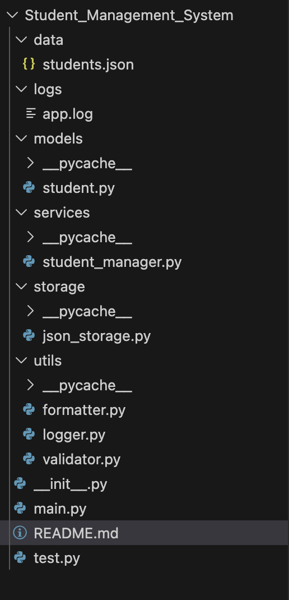
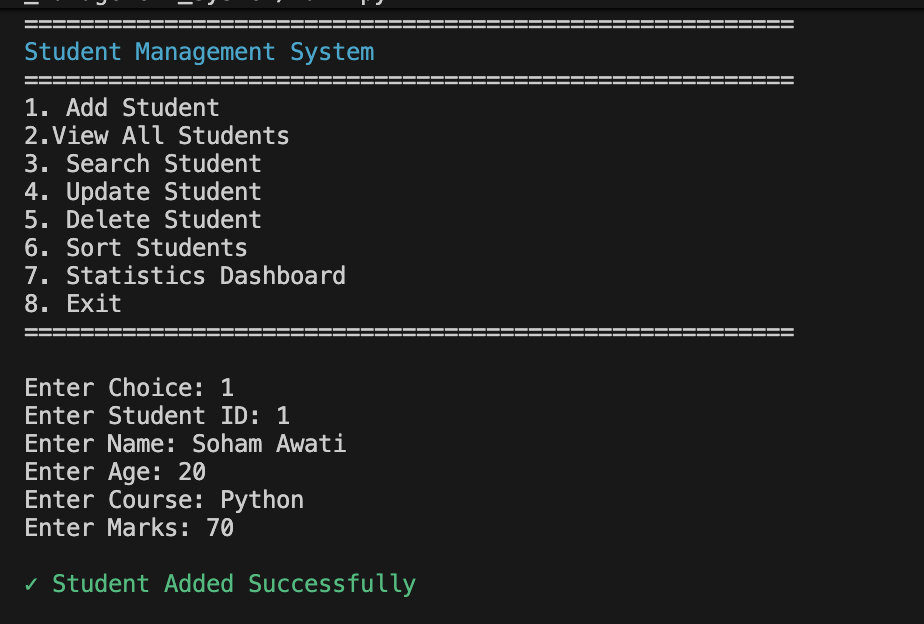
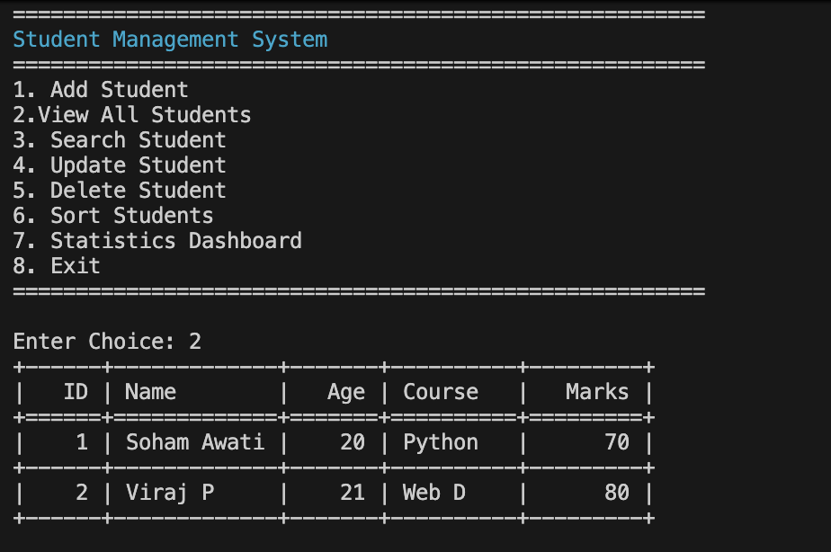
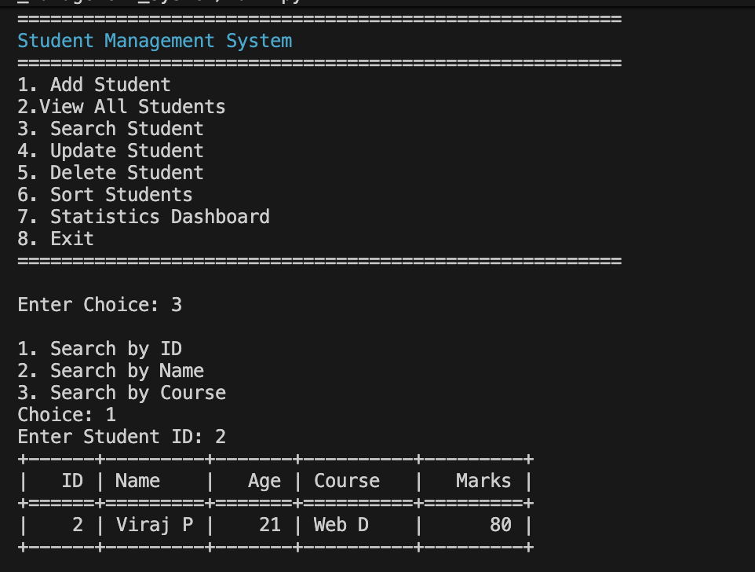
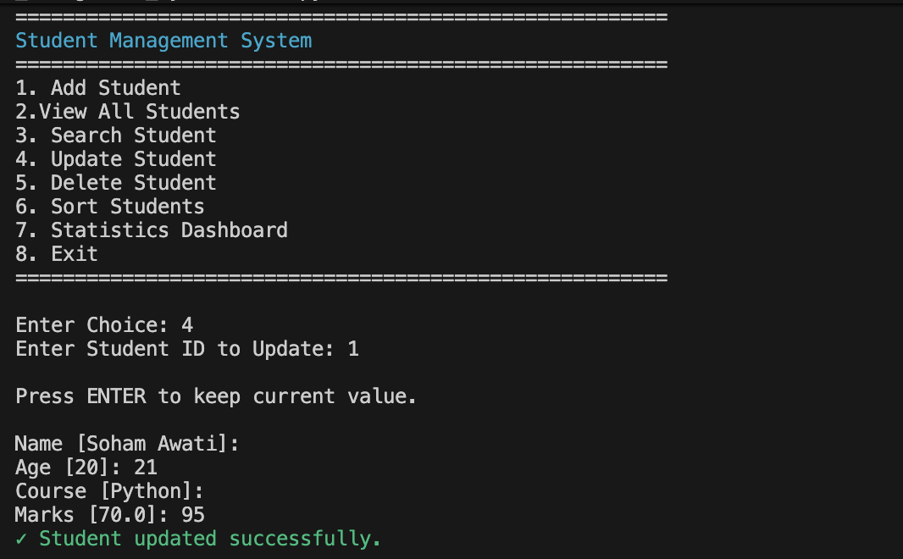
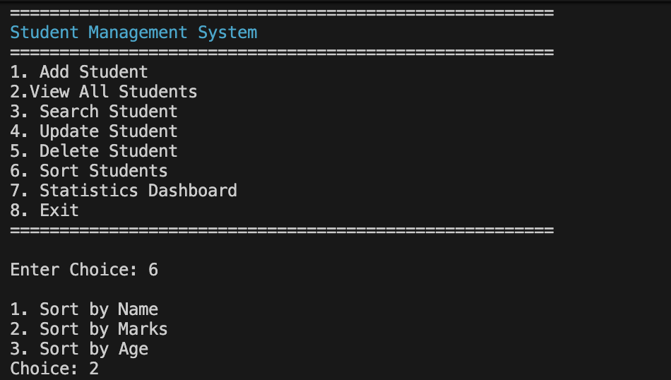
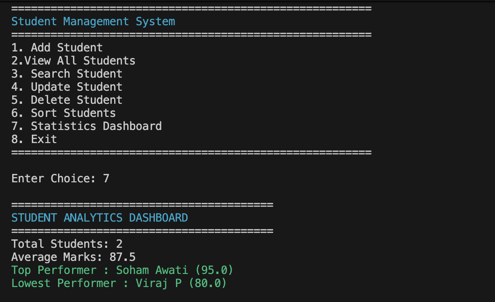
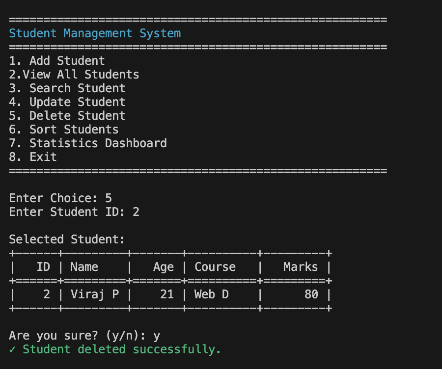

<<<<<<< HEAD
# Student Information Management System

## Overview

A professional console-based Student Information Management System developed using Python.

This application allows users to manage student records efficiently through a menu-driven interface while demonstrating Object-Oriented Programming, JSON persistence, exception handling, logging, analytics, and clean software architecture.

---

## Features

### Core Features

- Add Student
# Student Information Management System

## Overview

A professional console-based Student Information Management System developed using Python.

This application allows users to manage student records efficiently through a menu-driven interface while demonstrating Object-Oriented Programming, JSON persistence, exception handling, logging, analytics, and clean software architecture.

---

## Features

### Core Features

- Add Student
- View Students
- Search Student
- Update Student
- Delete Student

### Advanced Features

- JSON Data Persistence
- Student Analytics Dashboard
- Student Sorting
- Duplicate ID Prevention
- Activity Logging
- Automatic Backup Creation
- Report Exporting
- Input Validation
- Professional Console UI

---

## Technologies Used

- Python 3
- OOP
- JSON
- Colorama
- Tabulate
- Logging Module

---

## Folder Structure



## Installation

```bash
git clone <repository-url>
cd student_management_system
pip install -r requirements.txt
python main.py
```

---

## Sample Output









## Future Enhancements

- SQLite Database Support
- User Authentication
- CSV Export
- Graphical Dashboard

---

## Author

Soham Awati
Python Development Intern
